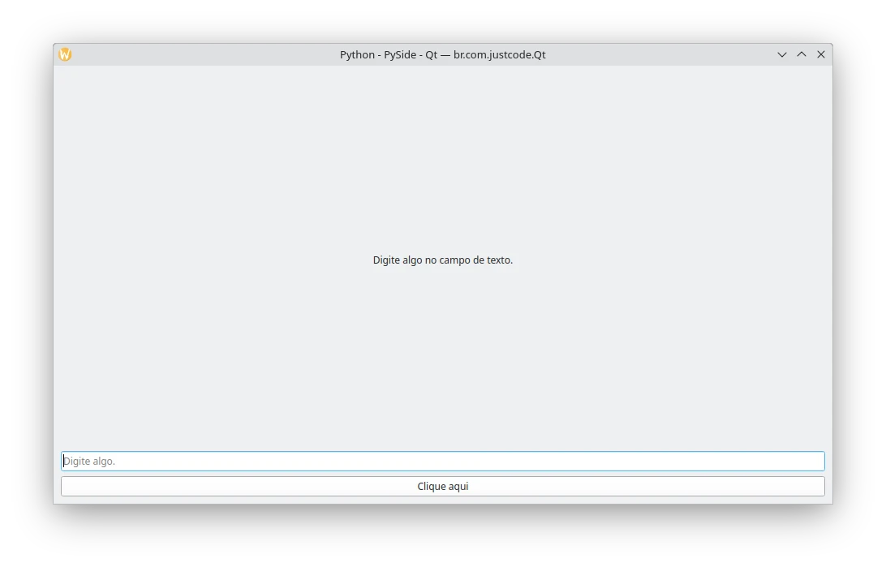

# Python - PySide - Qt - QML

Initial template for projects with [Python](https://www.python.org/) and [Qt](https://www.qt.io/) framework.

## 🤓 Author

Repository created with 💙 by [Renato Cruz](https://github.com/natorsc) 🤜🤛 Feel free to reach out!

[](mailto:natorsc@gmail.com "Send an email.")

Check out programming and technology content on:

[](https://justcode.com.br/ "Visit the justCode blog.")

[](https://justcode.com.br/ "Visit the justCode blog.")

A playlist I often listen to while studying or coding 😁:

[](https://open.spotify.com/playlist/1xf3u29puXlnrWO7MsaHL5?si=A-LgwRJXSvOno_e6trpi5w&utm_source=copy-link "Access the playlist.")

---

## 💝 Donations

Thank you for your donation, it's through your support that I can maintain this content 😊.

### Github

https://github.com/sponsors/natorsc/

### Pix (Brazil)

**Key**: `b1839493-2afe-484d-9272-82a3e402b36f`

---

## Publishing

### Wheels

**Build**:

```bash
uv build
```

> The above command will generate a folder with the name `dist` and the files `*.whl` and `*.tar.gz` will be inside it. 

### Flatpak

#### Dependencies

**KDE**:

```bash
flatpak install \
flathub \
org.kde.Platform/x86_64/6.8 \
org.kde.Sdk/x86_64/6.8
```

**PySide**:

```bash
flatpak install \
flathub \
io.qt.PySide.BaseApp/x86_64/6.8
```

#### Flatpak pip generator

Tool assists in creating project dependencies.

```bash
wget \
https://raw.githubusercontent.com/flatpak/flatpak-builder-tools/master/pip/flatpak-pip-generator \
--directory-prefix .venv/bin
```

Or:

```bash
curl --create-dirs -O \
--output-dir .venv/bin/ \
https://raw.githubusercontent.com/flatpak/flatpak-builder-tools/master/pip/flatpak-pip-generator
```

**Example**:

```bash
python \
.venv/bin/flatpak-pip-generator \
markdown
```

Finally add the `*.json` file generated in the `modules` key.

**Example**:

```json
"modules": [
  "modules/package-name-01.json",
  "modules/package-name-02.json"
]
```

#### Packaging

**Build**:

```bash
flatpak-builder \
--force-clean \
flatpak-build-dir \
br.com.justcode.Qt.json
```

**Test the flatpak build:**:

```bash
flatpak-builder \
--run \
flatpak-build-dir \
br.com.justcode.Qt.json \
app-name
```

**Test the translation**:

```bash
flatpak-builder \
--run \
--env=LC_ALL=pt_BR.UTF-8 \
flatpak-build-dir \
br.com.justcode.Qt.json \
app-name
```

**Build a distributable nightly flatpak bundle**:

```bash
flatpak-builder \
--repo app-name-master \
--force-clean \
--ccache \
flatpak-build-dir \
br.com.justcode.Qt.json
```

```bash
flatpak \
build-bundle \
app-name-master \
app-name.flatpak \
br.com.justcode.Qt
```
